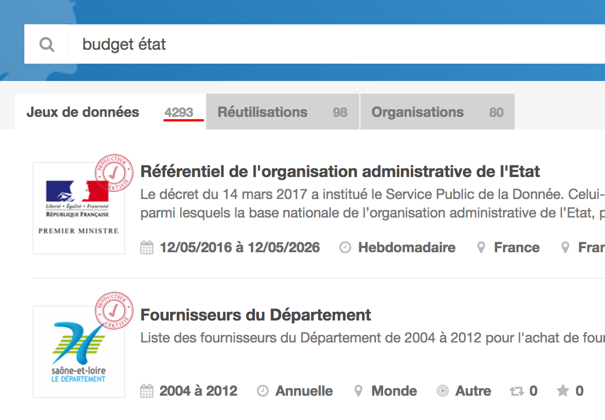
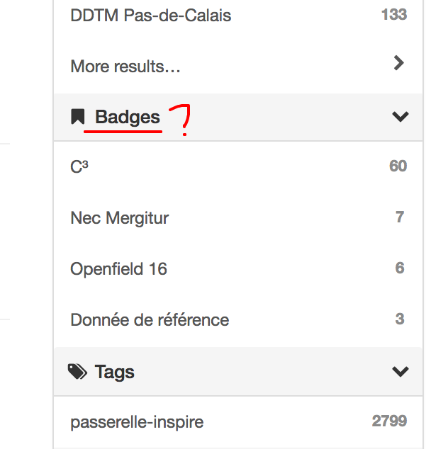
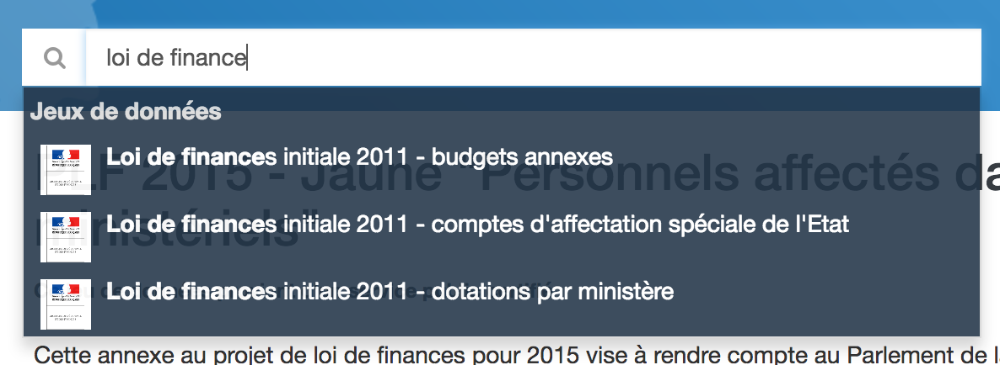
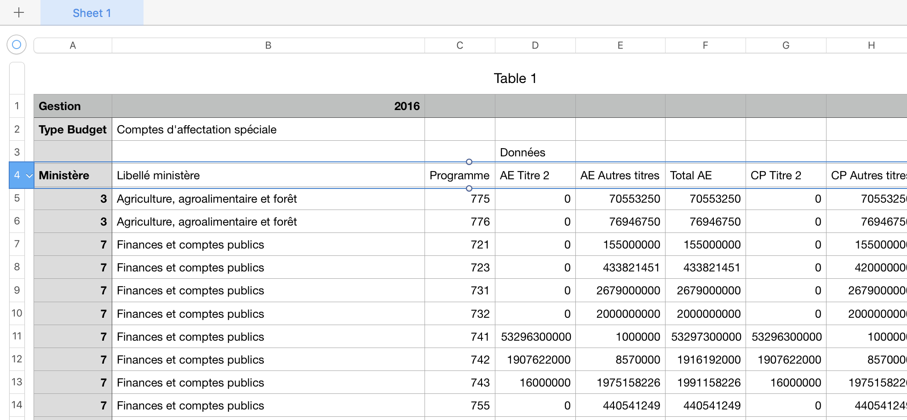

# Entretien avec Pierre Chrzanowski

## Présentation

Pierre travaille dans le monde de l'Open Data depuis 2010 environ. Il a commencé comme chargé du numérique à l'ambassade de France à Londres lors de l'élaboration de [data.gouv.fr](https://www.data.gouv.fr/fr/).

Pierre a participé à la production d'un rapport sur l'Open Data au Royaume-Uni, animé des conférences autour du sujet ce qui a par la suite mené à créer [Open Knowledge Foundation France](https://fr.okfn.org/).

Par la suite, il s'est focalisé sur l'accompagnement de pays et d'organisations à mettre en place des initiatives d'Open Data ainsi qu'à comprendre les utilisateurs, notamment pour le compte de la _Banque Mondiale_.

## Thématique • Découverte des données

🗣 Utilisation de data.gouv.fr principalement pour l'alimentation d'[Open Data Index](https://index.okfn.org/place/fr/) — à savoir 15 jeux de données qui doivent être **nécessairement de qualité**.

> Je ne suis pas un utilisateur de données publiques. Plutôt un observateur, consultant, travaillant à leur **mise en commun**.

---

🔍 "[budget](https://www.data.gouv.fr/fr/search/?q=budget)"

> Je ne fais pas confiance à l'autocomplete car les propositions sont vieilles.

❗️ D'ailleurs en validant le formulaire, ça ne lance pas la recherche mais emmène vers le jeu de données précédemment survolé.

❗️ Et une fois survolé, il est impossible de le désélectionner.

🔍 "[budget état](https://www.data.gouv.fr/fr/search/?q=budget+%C3%A9tat)"

😨 4293 résultats, j'en fais quoi ?

❓ Ils veulent dire quoi les badges ?

➡️ Cherche MinéFi / DGFip dans les facettes _parce que je sais_ qu'ils peuvent produire les données du budget.

❓ Je suis censé savoir à quoi correspondent les titres ?

---

🔍 "[loi de finance 2016](https://www.data.gouv.fr/fr/search/?q=loi+de+finance+2016)"

😯 Rien de récent.

😤 Rien du tout (en autocomplete).

(On lance la recherche)

> On choisit lequel ?

🔗 [Loi de finances initiale pour 2016 (LFI 2016)](https://www.data.gouv.fr/fr/datasets/loi-de-finances-initiale-pour-2016-lfi-2016/)

😯 18 ressources, ça fait beaucoup ! Combien je fais pour savoir quel est le budget voté pour Etalab dedans ?

---

👍 On a réussi à trouver la donnée même si ça aurait pu être plus facile.

## Thématique • Compréhension des données

🔗 "[PLF 2015 - Jaune "Personnels affectés dans les cabinets ministériels"](https://www.data.gouv.fr/fr/datasets/plf-2015-jaune-personnels-affectes-dans-les-cabinets-ministeriels/)"

> Ce n'est que maintenant que je comprends qu'il y a _10 ressources_ associées à un jeu de données.

> Je n'ai pas assez de connaissances sur le budget pour comprendre ce qui est produit.

🤔 Ah, _projet de loi de finance_. Ce n'est qu'une annexe ? Je dois faire une nouvelle recherche pour trouver des données budgétaires.

## Thématique • Utilisation des données

🗣 Les données employées sont souvent destinées à être croisées avec celles d'autres pays.

🔗 [Loi de finances initiale pour 2016 (LFI 2016)](https://www.data.gouv.fr/fr/datasets/loi-de-finances-initiale-pour-2016-lfi-2016/)

> Ah tiens, quand je double-clique sur le fichier CSV, Excel se lance mais sans faire le _distingo_ des colonnes.

😤 Les données démarrent en quatrième ligne.

😕 Je n'ai pas d'aide pour comprendre comment manipuler les données.

> C'est impossible de comprendre si on n'est pas _expert_.

> Il y a plein de fichiers différents et autant de manières différentes de les exploiter — peu se ressemblent.

> Les fichiers sont ouverts mais pas utilisables sans fournir _un gros effort_ ; sans compter qu'on n'est que peu aidé dans le processus de réutilisation.

## Thématique • Contributions

## Conclusion

> Avant, seuls celles et ceux qui avaient de l'argent pouvaient faire ce travail [de réutilisation des données].
> Avec l'Open Data c'est devenu un pot commun.

## ROTI • Retour sur le Temps Investi

- 👍 Entretien traduit le changement **vers des données de qualité**.
- 👍 Ça m'a fait réfléchir.
- 🤔 Peut-être mieux préciser/définir les artéfacts de l'entretien lors de l'introduction.