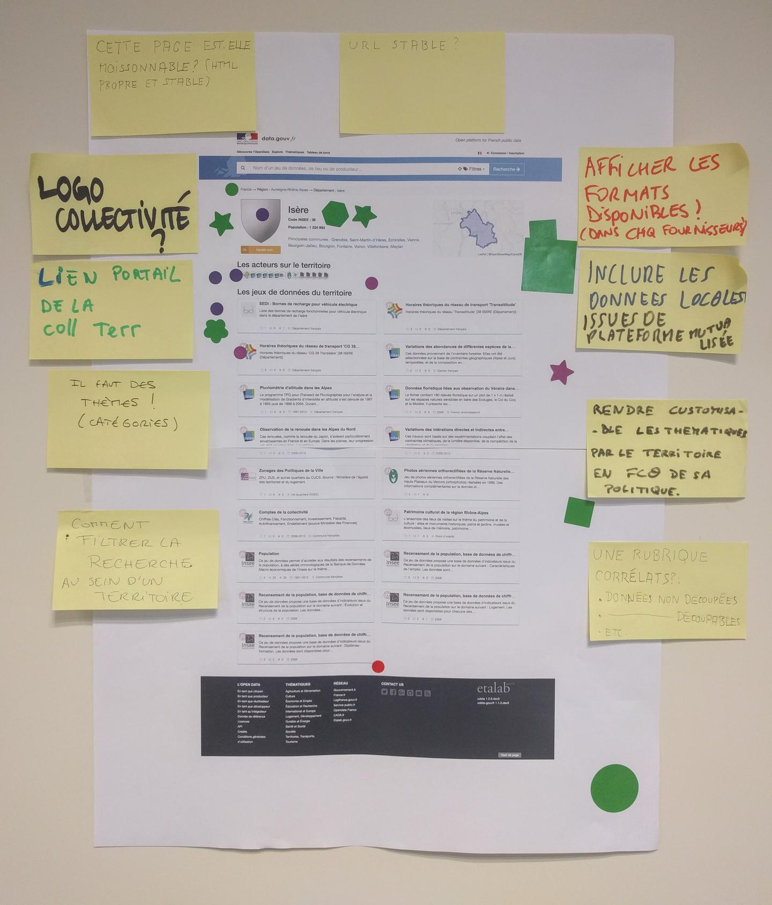
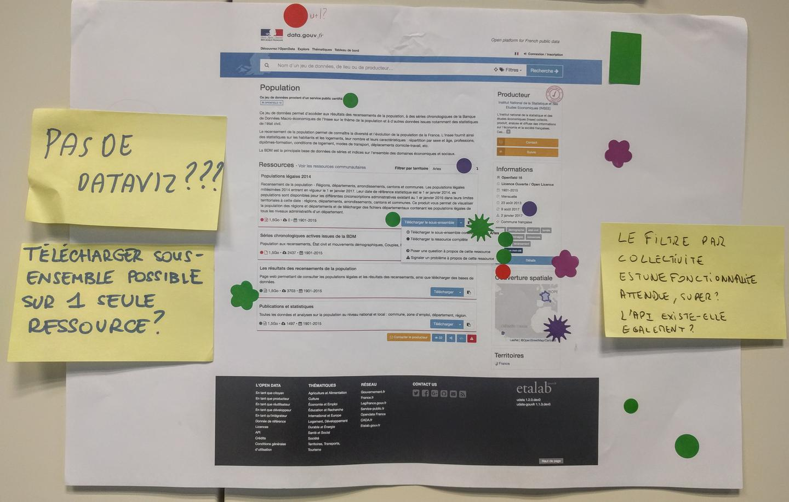
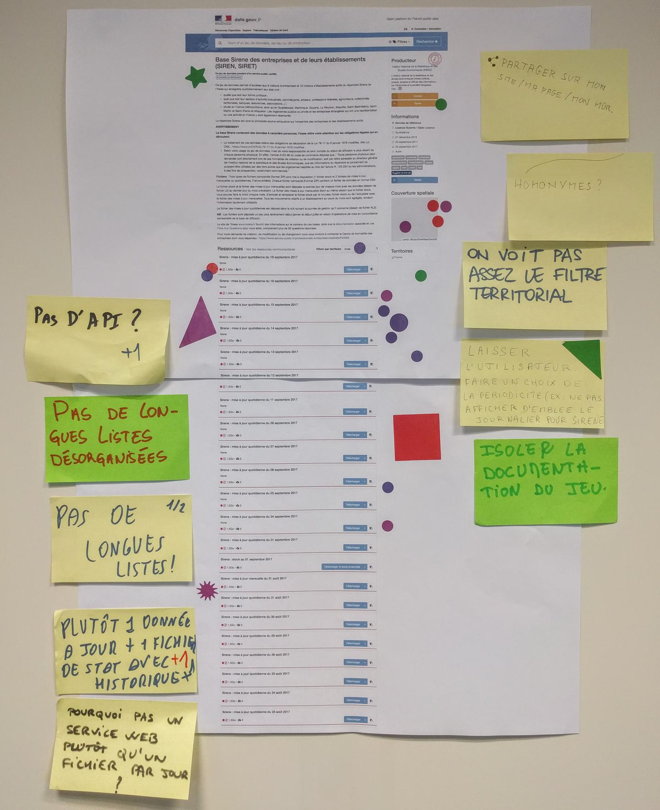

# Workshop « prototype de téléchargement de sous-ensemble géographique »

**Sommaire**

- [Règles et organisation](#règles-et-organisation)
- [Contributions des participant·e·s](#contributions)
- [Vision du futur](#vision-du-futur)

# Règles et organisation

L'atelier était organisé sur un créneau de 1h30, de 14h30 à 16h00 environ.

1. 5 minutes pour se lever et les regarder, en silence
2. 5 minutes pour mettre des gommettes
  - **VERT** • Chouette ! Ça répond à mes besoins !
  - **VIOLET** • Ça m'interroge. Je ne comprends pas. J'ai une question.
  - **ROUGE** • Ca me gêne. Mon boss ne sera pas content.
3. 5 minutes pour regarder, se poser des questions
4. Les post-its ça marche comment ?
4. 15 minutes pour écrire des idées, questions et les placer où ça vous chante
5. 30-40 minutes (ou plus) où on en parle
	- présentation du bâton de parole
	- un post-it = 5 minutes
	- au bout de 5 minutes on décide ensemble si on continue ou on passe à un autre sujet
6. https://github.com/etalab/user-research
7. ROTI !
8. Merci 🙂

Les durées étaient données à _titre indicatif_ : rien n'a été fait pour les respecter ; **les changements d'étape étaient pilotés par l'attitude et les envies des participant·e·s**.

# Contributions

## Page « Index Territoires »

**Notes** :

- Absence DROM/TOM
- Entrée par département ?
- Pouvoir zoomer
- Dissocier les interfaces graphiques selon les utilisateurs (citoyen, producteur, …)
- La liste n'est pas très lisible
- Masquer notre complexité administrative
- Rendre visible les multicouches
- Sélection géographique autre par l'emprise administrative (ex : par POI)

## Page « Territoire • Département »

**Notes** :

- Afficher les formats disponibles (dans chaques fournisseurs)
- Inclure les données locales issues de plateformes mutualisées
- Rendre customisables les thématiques par le territoire en fonction de sa politique
- Une rubrique corrélats :
  - Données non découpées
  - Données découpables
  - etc.
- Comment filtrer la rechercher au sein d'un territoire
- Il faut des thèmes ! (catégories)
- Lien vers le portail de la collectivité territoriale
- Logo collectivité ?
- Cette page est-elle moissonnable ? (HTML propre et stable)
- URL stable ?

## Page « Territoire • Commune »

**Notes** :

- Harmoniser les titres
- Valoriser des thématiques (transport, etc.)
- Comment les pages sont-elles alimentées ?
- Avoir une liste organisée et ramassée
- Moissonnage vers les portails locaux !
- Est-ce qu'on peut alimenter automatiquement le portail local (à partir de cette page)
- Différenciation données locales et nationales
- Question affichage des logos ? On retrouve les mêmes
- Rentre plus visible les acteurs sur le territoire
- Le logo laisse à penser que ce sont les données produites par la ville

## Page « Dataset • Téléchargement de sous-ensemble »

### Variante : fonctionnalité disponible (dropdown fermée)

**Notes** :

- Explication logo "Certifié"
- Commentaire anonyme
- Formats disponibles ?

### Variante : fonctionnalité disponible (dropdown ouverte)

**Notes** :

- Le filtre par collectivité est une fonctionnalité attendue, super ? L'API existe-elle également ?
- Télécharger le sous-ensemble possible sur une seule ressource ?
- Pas de dataviz ???

### Variante : fonctionnalité indisponible

**Notes** :

- Le label « producteur certifié » permet de se rassurer sur la pérénité de la donnée (mise à jour régulières + qualité)
- Difficulté de gérer métropole et DOM/TOM sur la même carte
- Mieux revaloriser les réutilisations (cf. bloc noir en bas de la page)
- La communauté doit-elle envisager de rajouter d'autres langages ? (type PHP, Perl, etc.)

### Variante : fonctionnalité disponible (nombreuses ressources)

**Notes** :

- Partager sur mon site / ma page / mon mur
- Homonymes (cf. titres de ressources quasi identiques)
- On ne voit pas assez le filtre territorial
- Laisser l'utilisateur faire un choix de périodicité (ex ne pas afficher d'emblée le journaliser sur SIRENE)
- Isoler la documentation du jeu
- Pourquoi pas un service web plutôt qu'un fichier par jour ?
- Plutôt 1 ressource à jour + 1 fichier de stat avec historique +1 +1
- Pas de longues listes !
- Pas de longues listes désorganisées
- Pas d'API ? +1

# Vision du futur

## Page « Index Territoires »

La présence de _carte_ fait systématiquement remonter la quadrature échelle/complétude d'affichage de la France et des territoires d'outre-mer.

**Piste possible** :

- un participant indiquait avoir résolu ce problème ; il serait susceptible de partager sa méthode avec nous.

La **navigabilité de la carte** est également mentionnée. Pour entamer une navigation autrement que par région ; avec un autre niveau de granularité, par liste ou par le biais de la carte.

## Page « Territoire »

Les pages Territoire (département et commune) ont été _volontairement_ présentées à plat, sans tri — sans signaler cette intention aux participant·e·s.

Deux envies se dégagent :

- **trier les jeux de données par fraicheur**
- organiser les jeux de données en **thématiques**

Le **regroupement en thématiques** (urbanisme, social, etc.) semble être la piste communément acceptée comme mécanisme donnant davantage de lisibilité aux longues listes.
L'intérêt de vocabulaires comme [Eurovoc][] aideraient à faire converger les portails vers des libellés normalisés.

Ce regroupement en thématiques a mis en avant l'ambiguïté du _territoire_, celui-ci pouvant être perçu comme étant le _domaine_ de la collectivité en assurant sa gestion.
Un traitement textuel pédagogique aiderait à **clarifier la portée de la page** et à **signifier ses intentions**.

Par extension, la section "les acteurs du territoire" pourrait également bénéficier d'un traitement textuel pour clarifier l'intention de cette section.
_Par exemple_ : <q>X acteurs locaux et Y acteurs nationaux ont publié Z jeux de données et Z' ressources téléchargeables sur data.gouv.fr</q>.

La diversité des producteurs et des titres de jeux de données au sein d'une page ont mis en évidence une **inégalité de leur compréhension**, et donc de leur découverte ; certains titres étant particulièrement cryptiques.

Deux envies se dégagent :

- **recommander des titres** de jeux de données (contributions communautaires)
- **donner des consignes rédactionnelles** pour aider à structurer les titres

Certaines personnes ont mentionné la **comparabilité de jeux de données**, notamment en distinguant celles qui ne concernent _que_ ce territoire et celles qui s'étendent _au-delà_ du territoire.

## Page « Dataset »

Le **bouton Télécharger** a été compris. Il a suscité un intérêt à obtenir un équivalent du côté de l'API. Le scrapping a été mentionné. Certain·e·s participant·e·s ont indiqué que si on peut scrapper, on peut tout aussi facilement accéder à l'API.

Par extension, <q>avoir la même chose sur mon site</q> revient régulièrement dans les discussions. La réintégration du widget `data.gouv.fr` et/ou le [widget Metaclic][] pourraient fournir des pistes d'intégration facile.

Le **nombre de téléchargements** et le **poids du fichier** ont été compris et appréciés.

Le **format et type des ressources** (tabulaire, géographique, etc.) n'étaient pas visibles. Leur traitement graphique devra être ajusté.

Des personnes en charge de portails Open Data ont mentionné exposer les **addresses email de contact** (en tant que _producteur_ ou _mainteneur_). Ce n'est à ce jour pas exploité par `data.gouv.fr`.

La présence du logo « producteur certifié » rassure. Il interroge néanmoins, entre autres de par l'absence d'explications : qu'est-ce que ça implique et comment l'obtenir ?

# API

Des questionnements récurrents étaient liés à la _possibilité d'intégrer les données et métadonnées de pages de data.gouv.fr sur leurs propres portails_. Par exemple, pouvoir récupérer la liste des jeux de données d'une page Territoire ou les ressources d'une page Jeu de données.

L'[API data.gouv.fr][] étaient la réponse systématique. Son utilité, sa documentation ou ce qu'elle retournait n'était pas ou peu connue, pas ou peu comprise.

> L'API, elle est où ?

> Est-ce que je peux intégrer les jeux de données et les métadonnées d'une page territoire, pour les intégrer sur mon portail à moi ?

**Pistes possibles** :

- présenter des commandes prêtes à l'emploi (type `curl`) au sein des pages de `data.gouv.fr` ;
- animer des ateliers `data.gouv.fr/api` dans le cadre de la mission [Opendata Locale][].

[data.gouv.fr]: https://www.data.gouv.fr/
[widget Metaclic]: https://github.com/datakode/metaclic
[Eurovoc]: http://eurovoc.europa.eu/
[Opendata Locale]: https://opendatalocale.net/
[API data.gouv.fr]: https://www.data.gouv.fr/api/
